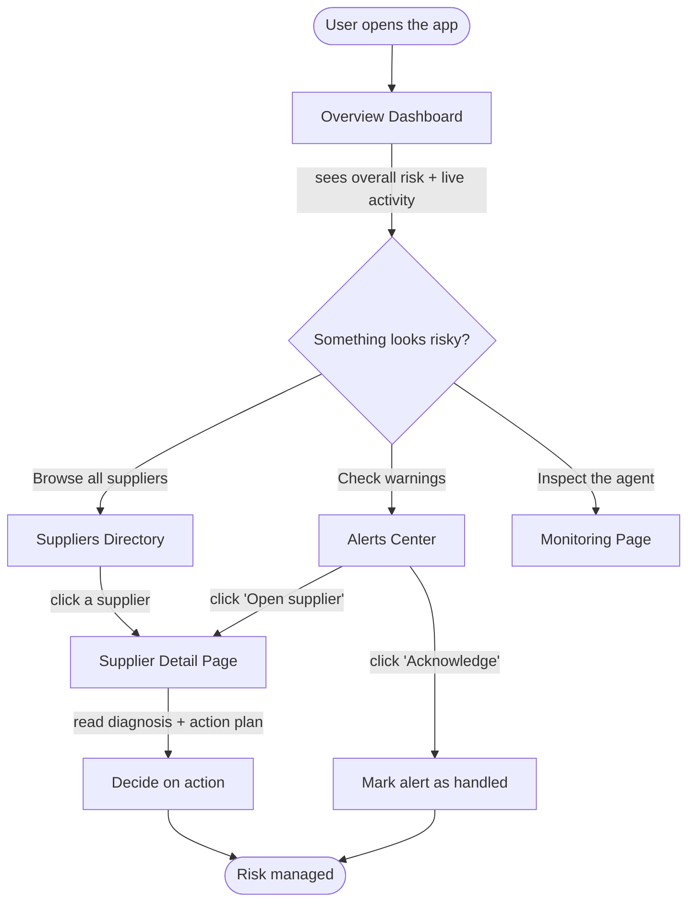
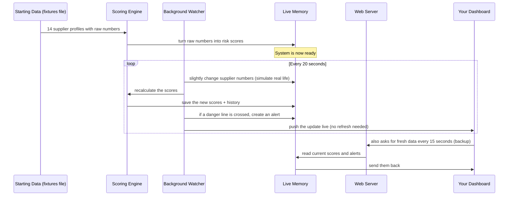
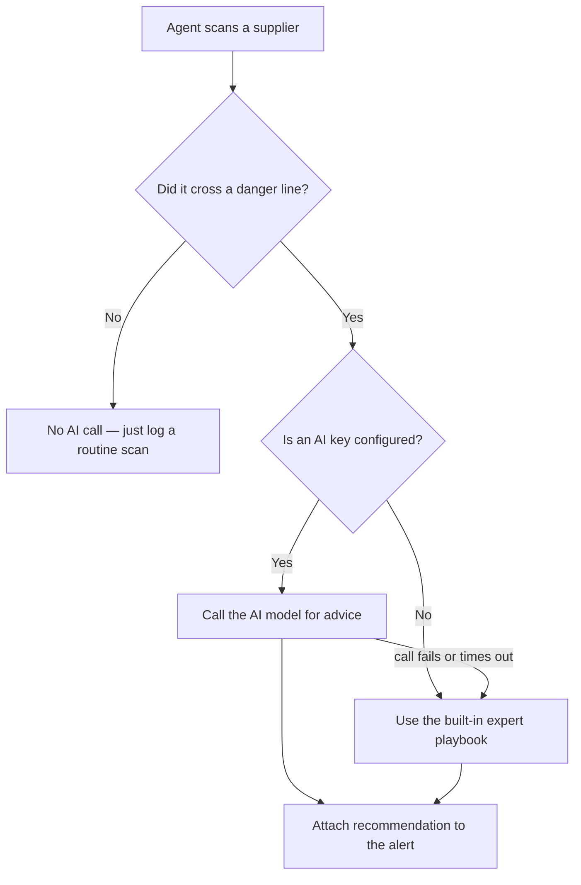
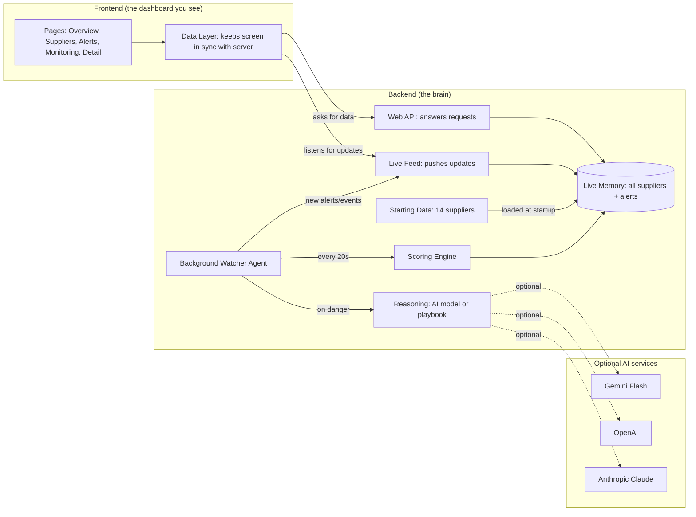

# SCMDOJO RiskScan — Supplier Risk Scan Agent

An autonomous system that continuously watches your suppliers, scores how risky each one is, and raises alerts (with recommended actions) the moment a supplier becomes dangerous to your business.

Think of it as a **24/7 risk analyst** for your supply chain that never sleeps, never forgets to check, and explains its reasoning every time.

---

## Table of Contents

1. [What Problem This Solves (in plain words)](#1-what-problem-this-solves-in-plain-words)
2. [Supply Chain Terms Explained](#2-supply-chain-terms-explained)
3. [Procurement Action Terms (RFQ and friends)](#3-procurement-action-terms-rfq-and-friends)
4. [What the System Does](#4-what-the-system-does)
5. [The Five Risk Dimensions](#5-the-five-risk-dimensions)
6. [How a User Interacts With It (Full User Flow)](#6-how-a-user-interacts-with-it-full-user-flow)
7. [What Actions a User Can Perform](#7-what-actions-a-user-can-perform)
8. [How the Data Flows (Step by Step, No Jargon)](#8-how-the-data-flows-step-by-step-no-jargon)
9. [How Risk Is Scored — Deep Worked Examples With Real Data](#9-how-risk-is-scored--deep-worked-examples-with-real-data)
10. [Which AI Model Is Called, When, and How](#10-which-ai-model-is-called-when-and-how)
11. [Example Use Cases](#11-example-use-cases)
12. [Architecture](#12-architecture)
13. [Running the Project](#13-running-the-project)
14. [Project Structure](#14-project-structure)
15. [Configuration](#15-configuration)

---

## 1. What Problem This Solves (in plain words)

Big companies buy parts and materials from hundreds of **suppliers** (the companies that sell them goods). If even one important supplier suddenly fails — goes bankrupt, stops delivering on time, gets caught breaking environmental laws, or is located in a country that goes to war — it can shut down a whole factory.

The problem is that humans cannot manually watch hundreds of suppliers every single day across many different types of risk. There is simply too much information.

**This system does that watching automatically.** It keeps a constant eye on every supplier, measures their risk from many angles, and taps you on the shoulder only when something actually needs your attention — along with a clear explanation and a suggested plan of action.

---

## 2. Supply Chain Terms Explained

Before going further, here are the industry terms used in this project, explained simply:


| Term                                        | What it actually means                                                                                                                    |
| ------------------------------------------- | ----------------------------------------------------------------------------------------------------------------------------------------- |
| **Supplier / Vendor**                       | A company that sells you parts, materials, or services.                                                                                   |
| **Procurement**                             | The department/job of buying things for a company.                                                                                        |
| **Procurement Officer**                     | The person responsible for buying and managing suppliers. (In the app, this is "Alexandra Morgan, Chief Procurement Officer".)            |
| **Supply Chain**                            | The full network of suppliers, factories, and transport that gets a product made and delivered.                                           |
| **Portfolio**                               | The complete set of suppliers a company is working with. ("Portfolio risk" = the overall risk across all of them.)                        |
| **Risk Dimension**                          | One category/angle of risk (for example, financial risk or compliance risk).                                                              |
| **Tier**                                    | How important a supplier is. **Tier 1** = most critical/strategic; **Tier 3** = least critical.                                           |
| **On-Time Delivery (OTD)**                  | The percentage of orders the supplier delivered on schedule. Higher is better.                                                            |
| **Defect Rate**                             | The percentage of delivered items that were faulty. Lower is better.                                                                      |
| **Capacity Utilization**                    | How much of a factory's total production ability is being used. Too high (over-stretched) or too low (struggling) are both warning signs. |
| **SLA (Service Level Agreement)**           | A written promise about quality/speed (for example, "defects must stay below 2%"). Breaking it is a "breach".                             |
| **DSO (Days Sales Outstanding)**            | How many days a company takes to collect money it is owed. High numbers can signal cash-flow trouble.                                     |
| **Debt Ratio**                              | How much of the company is funded by debt. Higher means more financially fragile.                                                         |
| **Profit Margin**                           | How much profit the company keeps from each sale. Thin margins mean little safety cushion.                                                |
| **Revenue Trend**                           | Whether the company's sales are growing (positive) or shrinking (negative).                                                               |
| **Credit Score**                            | A number (300–850) measuring how financially trustworthy a company is. Higher is healthier.                                               |
| **ISO 9001**                                | An international quality-management certificate. If it expires, the supplier is no longer formally "qualified".                           |
| **Audit**                                   | An official inspection of the supplier. "Stale audit" means it has not been checked in a long time.                                       |
| **Geopolitical Risk**                       | Risk caused by a supplier's country — wars, sanctions, instability, trade restrictions.                                                   |
| **Sovereign / Country Risk**                | A score (0–100) for how risky a whole country is to do business with.                                                                     |
| **Trade Restriction / Tariff**              | Government rules or taxes that make importing from a country harder or more expensive.                                                    |
| **ESG (Environmental, Social, Governance)** | A measure of how responsibly a company behaves — pollution (Environmental), worker treatment (Social), honest management (Governance).    |
| **News Sentiment**                          | Whether recent news about the supplier is positive or negative (a number from -1 = very negative to +1 = very positive).                  |
| **Mitigation**                              | The plan of action to reduce or fix a risk.                                                                                               |
| **Acknowledge an Alert**                    | A user clicking to confirm "I have seen this alert and I am handling it."                                                                 |


---

## 3. Procurement Action Terms (RFQ and friends)

The system's recommended actions use real procurement vocabulary. These are the terms you will see inside alerts and action plans, explained plainly:


| Term                                | What it actually means                                                                                                                                                                                                                                                                                                                                         |
| ----------------------------------- | -------------------------------------------------------------------------------------------------------------------------------------------------------------------------------------------------------------------------------------------------------------------------------------------------------------------------------------------------------------- |
| **RFQ (Request for Quotation)**     | A formal message sent to one or more suppliers asking, "If we ordered this, what price and delivery time can you give us?" It is the first step to lining up a new or backup supplier. When an alert says *"Activate dual-source RFQ across pre-qualified alternates,"* it means: send a price request to other approved suppliers so you have a ready backup. |
| **PO (Purchase Order)**             | The official document that places an order with a supplier. "Suspend new POs" means: stop sending this supplier new orders until the problem is fixed.                                                                                                                                                                                                         |
| **Dual-Sourcing**                   | Deliberately buying the same part from **two** suppliers instead of one, so that if one fails, the other can keep you running.                                                                                                                                                                                                                                 |
| **Nearshoring**                     | Moving sourcing to a **closer, lower-risk country** (for example, from a distant unstable region to a neighboring stable one) to reduce delay and political risk.                                                                                                                                                                                              |
| **Pre-Qualified Alternate**         | A backup supplier that has already been vetted and approved, so you can switch to them quickly.                                                                                                                                                                                                                                                                |
| **8D (Eight Disciplines)**          | A standard step-by-step problem-solving method factories use to find the root cause of a defect and fix it. An "8D corrective-action request" formally asks the supplier to investigate and fix a quality problem.                                                                                                                                             |
| **Corrective Action Plan (CAP)**    | A documented set of steps a supplier promises to take to fix a problem, with deadlines.                                                                                                                                                                                                                                                                        |
| **QBR (Quarterly Business Review)** | A formal meeting every three months where you and the supplier review performance and issues.                                                                                                                                                                                                                                                                  |
| **Landed Cost**                     | The **total** cost of a product once it actually arrives — price plus shipping, tariffs, insurance, and fees. Tariffs raise landed cost even if the sticker price is unchanged.                                                                                                                                                                                |
| **Safety Stock**                    | Extra inventory kept on hand as a buffer, so a delivery delay does not immediately stop production.                                                                                                                                                                                                                                                            |
| **REACH / SVHC**                    | European chemical safety rules. **REACH** is the regulation; **SVHC** (Substances of Very High Concern) is its watch-list of dangerous chemicals. A supplier using a listed chemical must disclose it.                                                                                                                                                         |
| **Section 301 Tariff**              | A specific United States trade rule that can add import taxes on certain goods from certain countries.                                                                                                                                                                                                                                                         |
| **DSO Watch / Credit Watch**        | Keeping a close eye on a supplier's payment-collection speed and credit health because early financial warning signs appeared.                                                                                                                                                                                                                                 |


---

## 4. What the System Does

In one sentence: **it scores supplier risk, watches it change over time, and alerts you with advice when risk gets too high.**

Broken down:

- **Scores every supplier** from 0 to 100, where higher means riskier.
- **Tracks 30 days of history** so you can see whether a supplier is getting better or worse.
- **Runs an automatic agent** in the background that re-checks suppliers on a timer (every 20 seconds in the demo, which represents the passage of time in a real deployment).
- **Raises alerts** when a supplier crosses a danger threshold.
- **Explains its reasoning** for every score and every alert (so you never see a number without knowing why).
- **Recommends actions** — either using an AI model or a built-in expert playbook if no AI key is provided.
- **Streams everything live** to the dashboard, so the screen updates by itself without you refreshing.

---

## 5. The Five Risk Dimensions

Every supplier is measured across five separate angles. Each gets its own 0–100 score, and they combine into one overall score.


| Dimension        | Plain-English question it answers                           | What it looks at                                                                     |
| ---------------- | ----------------------------------------------------------- | ------------------------------------------------------------------------------------ |
| **Financial**    | "Could this supplier run out of money or go bankrupt?"      | Credit score, days to collect payments, debt level, profit margin, revenue direction |
| **Operational**  | "Can this supplier actually deliver good products on time?" | On-time delivery, defect rate, factory capacity usage                                |
| **Compliance**   | "Is this supplier legally and officially in good standing?" | ISO 9001 certificate validity, rule violations, how recently they were audited       |
| **Geopolitical** | "Is this supplier's country a safe place to source from?"   | Country risk score, active trade restrictions                                        |
| **ESG**          | "Does this supplier behave responsibly?"                    | Environmental, social, and governance ratings, plus news sentiment                   |


**Risk bands** (used everywhere in the app, shown as colors):

- **Low** — score below 40 (green) → healthy
- **Medium** — score 40 to 69 (amber) → watch closely
- **High** — score 70 or above (red) → act now

---

## 6. How a User Interacts With It (Full User Flow)

The user is a procurement officer. Here is what they see and do, screen by screen.




### Screen 1 — Overview Dashboard (the home page)

When the user opens the app, they immediately see:

- A big **gauge** showing the overall portfolio risk (the average risk across all suppliers).
- **Summary cards**: how many critical alerts are open, how many suppliers are being watched, and how many automatic scans have run.
- A **distribution chart**: how many suppliers are low, medium, and high risk.
- A **Top 5 high-risk suppliers** list — the ones that need attention first.
- A **live agent activity feed** — a running log of what the automatic watcher just did. This updates on its own.

### Screen 2 — Suppliers Directory

A searchable, sortable table of every supplier. Search by name or country, filter by risk band, sort by score, see a mini 30-day trend line, and click any supplier to open its detail page.

### Screen 3 — Supplier Detail Page

Everything about one supplier: a circular risk score, a radar chart of all five dimensions, a 30-day timeline, a plain-English diagnosis, a numbered action plan, the exact numbers behind each score, and that supplier's active alerts.

### Screen 4 — Alerts Center

A list of all warnings. Filter by all / unacknowledged / critical / acknowledged. Each alert shows what went wrong, why it matters, and the recommended action with numbered steps. Acknowledge one or several at once, or jump to the supplier.

### Screen 5 — Monitoring Page

A look "under the hood": agent status, scans completed, alerts raised, which reasoning engine is active, the five monitoring channels, and the full activity log.

---

## 7. What Actions a User Can Perform

Here is the complete list of things a user can actually do, where they do it, and what happens behind the scenes.


| Action                               | Where                        | What happens behind the scenes                                                                                                                                                                                                      |
| ------------------------------------ | ---------------------------- | ----------------------------------------------------------------------------------------------------------------------------------------------------------------------------------------------------------------------------------- |
| **Search suppliers**                 | Suppliers Directory          | Filters the list instantly in the browser by name or country — no server call needed.                                                                                                                                               |
| **Filter by risk band**              | Directory, Alerts            | Shows only Low / Medium / High items. Instant, in the browser.                                                                                                                                                                      |
| **Sort by risk score**               | Directory                    | Reorders the table highest-to-lowest or lowest-to-highest.                                                                                                                                                                          |
| **Open a supplier**                  | Dashboard, Directory, Alerts | Navigates to the detail page and asks the server for that supplier's **full** data (raw numbers + per-dimension explanations).                                                                                                      |
| **Read the diagnosis & action plan** | Supplier Detail              | Displays the system's plain-English reasoning and recommended steps for that supplier.                                                                                                                                              |
| **Acknowledge one alert**            | Alerts Center                | Sends the alert's identifier to the server (`POST /api/alerts/ack`). The alert is marked "handled" everywhere, the critical-alert count drops, and the screen updates immediately (optimistically, before the server even replies). |
| **Bulk acknowledge**                 | Alerts Center                | Select several alerts with checkboxes and clear them all in one server call.                                                                                                                                                        |
| **Switch alert tabs**                | Alerts Center                | Toggles between All, Unacknowledged, Critical, and Acknowledged views.                                                                                                                                                              |
| **Watch the live feed**              | Dashboard, Monitoring        | The screen receives pushed updates over a live connection and re-renders by itself, no refresh.                                                                                                                                     |
| **Toggle a monitoring channel**      | Monitoring                   | Visual demonstration of enabling/disabling a risk dimension (interface-only in the current build).                                                                                                                                  |


### What the user does NOT have to do

- They do **not** trigger scans — the background agent does that automatically on a timer.
- They do **not** refresh the page — updates arrive live.
- They do **not** calculate any scores — the scoring engine does that from raw numbers.
- They do **not** write recommendations — the AI model or built-in playbook does that.

---

## 8. How the Data Flows (Step by Step, No Jargon)

This is the most important part: **where does the data come from, and how does it reach your screen?**

There is no real-world data feed and no database in this project (by design). Instead, the system generates realistic supplier data and keeps it in the computer's memory while running.




### In words

1. **Starting point.** When the system starts, it loads **14 pre-made supplier profiles** from a file. Each profile contains raw business numbers (credit score, defect rate, certificate dates, country, and so on) — not risk scores.
2. **First calculation.** The **scoring engine** reads those raw numbers and converts them into risk scores for each of the five dimensions, plus one overall score. It also builds a **30-day history** by simulating how the numbers would have evolved over the past month.
3. **The watcher wakes up.** A **background agent** runs on a timer. Every 20 seconds it picks a few suppliers, nudges their raw numbers slightly (simulating new information — a late delivery, a credit downgrade, a bad news article), recalculates their scores, saves the new values, adds a point to their history, and checks whether any **danger threshold** was crossed.
4. **Alerts get created.** If a supplier crosses a threshold (for example, defect rate goes above the 2% promised limit, or a certificate expires), the agent creates an **alert** and asks the reasoning engine (AI model or playbook) to write a recommendation and a step-by-step action plan.
5. **The screen updates two ways:**
  - **Live push (instant):** The server pushes every new event and alert to your dashboard through a constant open connection, so the screen updates by itself.
  - **Polling (backup):** As a safety net, the dashboard also asks the server for fresh data every 15 seconds, in case the live connection drops.
6. **You take action.** You read the alerts, open supplier details, and click **Acknowledge** when you have handled something. That action is sent back to the server and instantly reflected everywhere.

### Where the data lives

- **In memory only.** Everything is stored in the running program's memory. There is **no database**.
- **Resets on restart.** If you restart the backend, it re-creates the same starting suppliers and begins fresh. This is intentional and keeps the system self-contained.

---

## 9. How Risk Is Scored — Deep Worked Examples With Real Data

Risk scores are **never made up**. They are calculated from raw numbers using fixed formulas. Below we take a **real supplier from the system** and compute its score by hand, exactly the way the engine does it. (These numbers come straight from `backend/app/data/fixtures.json`, and the results match the live engine output precisely.)

### Example A — A HIGH-RISK supplier: "GlobalTech Manufacturing Co"

This is the system's worst supplier. Here is its raw data as loaded from the fixtures file:


| Category     | Raw numbers                                                                                                          |
| ------------ | -------------------------------------------------------------------------------------------------------------------- |
| Financial    | Credit score **520**, DSO **78 days**, debt ratio **0.58**, profit margin **3%**, revenue trend **-0.5** (shrinking) |
| Operational  | On-time delivery **86%**, defect rate **4.5%**, capacity utilization **94%**                                         |
| Compliance   | ISO 9001 **not certified** (expired **47 days** ago), **3** violations in 12 months, last audit **412 days** ago     |
| Geopolitical | Country **Myanmar** (country-risk **92/100**), **2** active trade restrictions                                       |
| ESG          | Environmental **55**, Social **48**, Governance **50**, news sentiment **-0.6** (negative)                           |


#### Step 1 — Financial score

Each raw number is turned into a 0–100 "sub-risk", then blended:

```
Credit risk  = (850 - 520) / 5.5            = 60.0
DSO risk     = (78 - 45) × 1.8              = 59.4
Debt risk    = (0.58 - 0.40) × 200          = 36.0
Margin risk  = (0.10 - 0.03) × 500          = 35.0
Trend risk   = -(-0.5) × 80                 = 40.0

Financial = 60.0×0.35 + 59.4×0.20 + 36.0×0.15 + 35.0×0.15 + 40.0×0.15
          = 21.00 + 11.88 + 5.40 + 5.25 + 6.00
          = 49.5   →  rounded down to 49
```

**Plain meaning:** weak credit, slow to collect money, fairly high debt, thin profit, and shrinking sales — but not catastrophic. **Financial = 49 (medium).**

#### Step 2 — Operational score

```
OTD risk    = (95 - 86) × 9                 = 81.0
Defect risk = 4.5 × 22                       = 99.0   (capped at 100)
Capacity    = 94% is over 92% → (94 - 92) × 8 = 16.0

Operational = 81.0×0.40 + 99.0×0.45 + 16.0×0.15
            = 32.40 + 44.55 + 2.40
            = 79.35  →  79
```

**Plain meaning:** deliveries are well below the 95% target and the defect rate (4.5%) is more than double the 2% promised limit. **Operational = 79 (high).**

#### Step 3 — Compliance score

```
Certificate expired 47 days ago → 60 + 47×0.4 = 78.8
Violations risk = 3 × 28                       = 84.0
Audit risk      = (412 - 180) × 0.18           = 41.76

Compliance = 78.8×0.50 + 84.0×0.30 + 41.76×0.20
           = 39.40 + 25.20 + 8.35
           = 72.95  →  72
```

**Plain meaning:** the quality certificate has lapsed, there are multiple violations, and they have not been audited in over a year. **Compliance = 72 (high).**

#### Step 4 — Geopolitical score

```
Country base (Myanmar)        = 92
Trade-restriction risk        = 2 × 9 = 18  (capped at 40)

Geopolitical = 92 × 0.85 + 18
             = 78.2 + 18
             = 96.2  →  96
```

**Plain meaning:** sourcing from a very high-risk country with active trade restrictions. **Geopolitical = 96 (high) — the worst dimension.**

#### Step 5 — ESG score

```
Ratings (higher is better, so we invert):
   100 - (55×0.4 + 48×0.3 + 50×0.3)
 = 100 - (22.0 + 14.4 + 15.0)
 = 100 - 51.4  = 48.6
Sentiment risk = -(-0.6) × 45 = 27.0  (capped at 45)

ESG = 48.6 × 0.75 + 27.0
    = 36.45 + 27.0
    = 63.45  →  63
```

**Plain meaning:** mediocre responsibility ratings plus clearly negative press. **ESG = 63 (medium, near high).**

#### Step 6 — Combining into the overall score

First a **weighted average** (operational and financial count slightly more):

```
Weighted = 49×0.22 + 79×0.24 + 72×0.20 + 96×0.18 + 63×0.16
         = 10.78 + 18.96 + 14.40 + 17.28 + 10.08
         = 71.5
```

Then we look at the **single worst dimension** (geopolitical = 96) and blend the two, giving the worst dimension real weight so one severe problem cannot hide behind healthier areas:

```
Overall = 0.65 × 71.5 + 0.35 × 96
        = 46.475 + 33.6
        = 80.075  →  80
```

**Final result: overall risk = 80 (HIGH).** The primary driver is flagged as **geopolitical** (its highest dimension), and because operational, compliance, and geopolitical are all in the danger zone, this supplier raises **multiple critical alerts**.

---

### Example B — A LOW-RISK supplier: "Reliable Components Inc"

The same math on a healthy supplier (Germany, strong finances) shows how the formulas reward good performance.


| Category     | Raw numbers                                                                                               |
| ------------ | --------------------------------------------------------------------------------------------------------- |
| Financial    | Credit score **810**, DSO **38 days**, debt ratio **0.25**, profit margin **14%**, revenue trend **+0.3** |
| Operational  | On-time delivery **99.5%**, defect rate **0.5%**, capacity **78%**                                        |
| Compliance   | ISO 9001 valid **320 days**, **0** violations, last audit **42 days** ago                                 |
| Geopolitical | Country **Germany** (country-risk **12/100**), **0** restrictions                                         |
| ESG          | Environmental **82**, Social **85**, Governance **88**, sentiment **+0.7**                                |


```
Financial:    credit (850-810)/5.5 = 7.3; everything else below threshold → 0
              = 7.3×0.35 ≈ 2
Operational:  OTD above target → 0; defect 0.5×22 = 11; capacity normal → 0
              = 11×0.45 ≈ 4
Compliance:   certificate valid, no violations, recent audit → 0
Geopolitical: 12 × 0.85 = 10.2 → 10
ESG:          100-(82×0.4+85×0.3+88×0.3)=15.3; positive news → 0 sentiment risk
              = 15.3×0.75 ≈ 11

Weighted = 2×0.22 + 4×0.24 + 0×0.20 + 10×0.18 + 11×0.16 = 4.96
Worst    = 11
Overall  = 0.65×4.96 + 0.35×11 = 3.22 + 3.85 = 7.07  →  7
```

**Final result: overall risk = 7 (LOW).** Every dimension is healthy, so the system reports **"No material risks detected"** and raises **no alerts**. This is the calm baseline a good supplier should look like.

---

### Why the "worst dimension" blend matters

Compare the two suppliers' overall scores:


| Supplier   | Plain average of 5 dimensions | System's overall (worst-blended) |
| ---------- | ----------------------------- | -------------------------------- |
| GlobalTech | (49+79+72+96+63)/5 = 71.8     | **80**                           |
| Reliable   | (2+4+0+10+11)/5 = 5.4         | **7**                            |


For GlobalTech, the worst-dimension blend **pushes the score up** (from ~72 to 80) because geopolitical risk is severe (96). A naive average would understate the danger. This mirrors how a real risk manager thinks: *"One catastrophic problem is still a catastrophe, even if four other things look fine."*

---

## 10. Which AI Model Is Called, When, and How

### Short answer

By default the system is configured for **Google Gemini Flash** (model name `gemini-flash-latest`). But it also supports **OpenAI** (`gpt-4o-mini`) and **Anthropic Claude** (`claude-3-5-haiku-latest`), and — most importantly — it works **with no AI at all** by falling back to a built-in expert playbook.

### When is the AI actually called?

The AI is **not** called on every scan. It is called **only when a new alert is raised** — that is, only when a supplier actually crosses a danger threshold. This keeps usage tiny and cheap. Routine scans that find nothing wrong never touch the AI.




### How the call works (Gemini example)

When an alert fires and a key is present, the system sends one web request to Google's API. It includes:

1. A **system instruction** telling the model it is a supplier-risk analyst and must reply in a strict format.
2. The **alert details**: supplier name, which dimension failed, severity, what the breach was, and a snapshot of the supplier's current scores.
3. A setting that forces the reply to be **structured data (JSON)** so the answer is always machine-readable.

The model replies with exactly three things:


| Field              | What it is                                  | Example                                                                                                                           |
| ------------------ | ------------------------------------------- | --------------------------------------------------------------------------------------------------------------------------------- |
| `recommendation`   | One or two sentences — the immediate action | "Suspend new purchase orders and require updated certification within 14 days."                                                   |
| `reasoning`        | Why this risk matters, citing the numbers   | "A lapsed ISO 9001 certificate invalidates supplier qualification for regulated programs and creates downstream audit liability." |
| `mitigation_steps` | 3–4 ordered, concrete steps                 | 1. Request renewal evidence; 2. Suspend new POs; 3. Schedule third-party audit; 4. Flag affected parts                            |


### The safety net: the built-in playbook

If **no API key** is set, or the AI call **fails or times out**, the system uses a deterministic expert **playbook** instead — a set of professionally written recommendation templates, one per risk dimension. This guarantees the app always produces useful advice and **runs perfectly with zero setup and zero cost**.

Every alert is tagged with its source so it is always transparent:

- **"AI REASONED"** badge → written by the AI model
- **"PLAYBOOK"** badge → written by the built-in fallback

### Why Gemini Flash was chosen as the default

- **Free tier available** (Google AI Studio) — an evaluator can run it without a credit card.
- **Fast and cheap** — ideal for short, structured advice on demand.
- **Reliable structured output** — native JSON mode keeps replies clean.

### How to switch the AI model

In `backend/.env`:

```
# Use Gemini (default)
LLM_PROVIDER=gemini
GEMINI_API_KEY=your_key_here

# Or use OpenAI
LLM_PROVIDER=openai
OPENAI_API_KEY=your_key_here

# Or use Anthropic Claude
LLM_PROVIDER=anthropic
ANTHROPIC_API_KEY=your_key_here

# Or leave all keys empty → built-in playbook (no AI calls)
```

The code that handles all of this lives in `backend/app/agent/llm.py` (the provider calls and the fallback) and `backend/app/agent/prompts.py` (the instructions sent to the model).

---

## 11. Example Use Cases

### Use case A: "Which supplier should I worry about today?"

1. User opens the **dashboard** and reads the **Top 5 high-risk suppliers** list.
2. Clicks the worst one (GlobalTech, score 80) to open its **detail page**.
3. Reads the diagnosis: geopolitical 96, operational 79, compliance 72.
4. Reads the action plan: shift volume to a backup, suspend new purchase orders, activate a dual-source RFQ.
5. Acts on it.

### Use case B: "A quality problem just happened — show me."

1. The background agent detects a supplier's defect rate crossed the 2% limit.
2. It instantly creates a **critical alert** and pushes it to the screen live.
3. User sees the new alert appear in the **Alerts Center** with an AI- or playbook-written plan.
4. Clicks **Acknowledge** to confirm they are handling it.

### Use case C: "Clear out the alerts I've already dealt with."

1. User goes to the **Alerts Center**, switches to the **Unacknowledged** tab.
2. Selects several alerts with the checkboxes.
3. Clicks **bulk acknowledge** to mark them all handled in one action.

### Use case D: "Is the watcher actually working?"

1. User opens the **Monitoring page**.
2. Sees the scans-completed number climbing and which reasoning engine is active.
3. Reads the live telemetry log of recent agent actions.

---

## 12. Architecture




| Part         | Technology                             | Job                                    |
| ------------ | -------------------------------------- | -------------------------------------- |
| Frontend     | React 19 + TanStack Start              | The dashboard the user sees            |
| Charts       | Recharts                               | Gauges, radar, and trend graphs        |
| Backend      | Python + FastAPI                       | The brain that scores and serves data  |
| Live updates | WebSocket                              | Pushes changes to the screen instantly |
| Reasoning    | Gemini / OpenAI / Anthropic (optional) | Writes alert recommendations           |
| Storage      | In-memory (no database)                | Holds all live data while running      |


---

## 13. Running the Project

You need two parts running at the same time: the **backend** (the brain) and the **frontend** (the dashboard).

### Start the backend

```bash
cd backend
python -m venv .venv

# Activate the virtual environment:
# On Windows:
.\.venv\Scripts\activate
# On Mac/Linux:
source .venv/bin/activate

pip install -r requirements.txt
uvicorn app.main:app --reload --port 8000
```

The backend now runs at `http://localhost:8000`. Open `http://localhost:8000/docs` to see all available data endpoints.

### Start the frontend

In a second terminal:

```bash
cd frontend
npm install
npm run dev
```

The dashboard now runs at `http://localhost:8080`.

### Optional: turn on AI-written recommendations

By default, the system uses a built-in expert **playbook**, so it works perfectly with **no setup and no keys**. To use an AI model instead, create `backend/.env`:

```
LLM_PROVIDER=gemini
GEMINI_API_KEY=your_free_key_here
```

(A free key is available from Google AI Studio.) Alerts will then show an "AI REASONED" badge instead of "PLAYBOOK".

### Manual vs automatic LLM assessment

The LLM is controlled by `LLM_MODE` (default **`manual`**):

- **`manual`** — alerts are raised in a **`pending`** state and **no LLM call is made automatically**. On the Alerts page, an operator clicks **"Run AI Assessment"** on a specific alert to invoke the model. This is ideal for demos/assessments because every model call is **deliberate and observable**.
- **`auto`** — the agent calls the LLM the instant an alert fires (original behaviour).

When an assessment runs, the Alerts UI shows an **LLM call trace** proving the call routed to the model: **provider/model**, whether it hit the **live LLM** or the **playbook fallback**, the **response latency (ms)**, and expandable views of the **exact prompt sent** and the **raw model response**. A live call takes ~1–3s and returns raw JSON; the playbook is instant — so the distinction is visually unambiguous.

> To see real `LIVE LLM` traces (not `PLAYBOOK FALLBACK`), a valid `GEMINI_API_KEY` must be set on the backend. Without a key the trace honestly reports "API key absent" and falls back.

API: `POST /api/alerts/{id}/assess` runs one assessment and returns `{ alert, meta }`.

---

## 13b. Deploying to Railway

This repo is a **monorepo** — backend and frontend live in separate folders. Railway must be told which folder each service uses, or the build fails in seconds (repo root has no `package.json` / `requirements.txt`).

Create **one Railway project with two services**, both from the same GitHub repo.

### Required settings (both services)

For **each** service, open **Settings** and set:

| Setting | Backend service | Frontend service |
| --- | --- | --- |
| **Root Directory** | `backend` | `frontend` |
| **Config file path** | `/backend/railway.json` | `/frontend/railway.json` |

> **Important:** `railway.json` does **not** follow the Root Directory. You must use the **full repo path** (`/backend/railway.json`, not `railway.json`). Without this, Railway builds from repo root and fails immediately.

Each service builds from its own `Dockerfile` (Python 3.11 for backend, Node 22 for frontend).

### Service 1 — Backend (FastAPI)

1. New Service → Deploy from GitHub → select this repo.
2. Set **Root Directory** = `backend` and **Config file path** = `/backend/railway.json`.
3. (Optional) Variables → `GEMINI_API_KEY` for AI reasoning (empty = playbook fallback).
4. Settings → Networking → **Generate Domain**. Copy the URL, e.g.
   `https://backend-production-xxxx.up.railway.app`

Health check: `/api/health`

### Service 2 — Frontend (TanStack Start / Nitro)

1. New Service → same repo.
2. Set **Root Directory** = `frontend` and **Config file path** = `/frontend/railway.json`.
3. Variables → **`VITE_API_URL`** = backend public URL from step 4 above.
   > **Build-time variable** — Vite inlines it during `docker build`. Set it **before** redeploying. WebSocket URL is derived automatically (`https` → `wss`).
4. Settings → Networking → **Generate Domain**.

### After both are live

- Open the frontend domain — it talks to the backend over HTTPS/WSS.
- `CORS_ORIGINS` defaults to `*`. To lock down, set it on the backend to the frontend domain.

---

## 14. Project Structure

```
SCMDOJO/
├── backend/                       # The brain (Python + FastAPI)
│   ├── app/
│   │   ├── main.py                # Starts the app and the background watcher
│   │   ├── config.py              # All settings (timers, keys, weights)
│   │   ├── schemas.py             # The shape of the data sent to the screen
│   │   ├── core/
│   │   │   ├── scoring.py         # Turns raw numbers into risk scores (the formulas above)
│   │   │   ├── store.py           # Holds all live data in memory
│   │   │   └── broadcast.py       # Pushes live updates to the screen
│   │   ├── agent/
│   │   │   ├── monitor.py         # The background watcher loop
│   │   │   ├── llm.py             # AI model + built-in playbook fallback
│   │   │   └── prompts.py         # Instructions given to the AI model
│   │   ├── api/                   # The web endpoints the screen talks to
│   │   └── data/
│   │       ├── generator.py       # Builds the 30-day history
│   │       └── fixtures.json      # The 14 starting suppliers (the raw numbers)
│   ├── requirements.txt           # Backend dependencies
│   ├── railway.json               # Railway deploy config (backend service)
│   └── .python-version            # Pins Python for the deploy builder
│
├── frontend/                      # The dashboard (React + TanStack Start)
│   ├── src/
│   │   ├── routes/                # The five pages
│   │   ├── state/RiskContext.tsx  # Keeps the screen in sync with the server
│   │   ├── components/            # Reusable visual pieces (gauges, layout)
│   │   ├── data/suppliers.ts      # The data shapes, matching the backend
│   │   └── lib/api/client.ts      # Talks to the backend
│   ├── package.json               # Frontend dependencies
│   ├── vite.config.ts             # Build config (Nitro node-server preset)
│   └── railway.json               # Railway deploy config (frontend service)
│
└── README.md                      # This file
```

---

## 15. Configuration

These settings live in `backend/.env` (all optional — sensible defaults are built in).


| Setting                  | Default  | What it controls                                        |
| ------------------------ | -------- | ------------------------------------------------------- |
| `LLM_PROVIDER`           | `gemini` | Which AI service to use for recommendations             |
| `GEMINI_API_KEY`         | empty    | Your AI key (empty = use the built-in playbook)         |
| `SCAN_INTERVAL_SECONDS`  | `20`     | How often the background watcher checks suppliers       |
| `SCAN_BATCH_SIZE`        | `3`      | How many suppliers it checks per cycle                  |
| `ALERT_COOLDOWN_MINUTES` | `30`     | Prevents repeating the same alert too often             |
| `WEIGHT_FINANCIAL`       | `0.22`   | How much financial risk counts toward the overall score |
| `WEIGHT_OPERATIONAL`     | `0.24`   | How much operational risk counts                        |
| `WEIGHT_COMPLIANCE`      | `0.20`   | How much compliance risk counts                         |
| `WEIGHT_GEOPOLITICAL`    | `0.18`   | How much geopolitical risk counts                       |
| `WEIGHT_ESG`             | `0.16`   | How much ESG risk counts                                |
| `CORS_ORIGINS`           | `*`      | Which web addresses are allowed to connect              |


The frontend has one setting, `VITE_API_URL` (default `http://localhost:8000`), which tells the dashboard where the backend is.

---

## Summary

**RiskScan is a self-running risk analyst for your suppliers.** It generates realistic supplier data, scores each supplier's risk from five angles using clear, transparent formulas (worked out in full above), watches those scores change over time, and alerts you — with reasoning and an action plan — the moment a supplier becomes dangerous. The AI is called only when an alert fires, and a built-in playbook guarantees it works even with no AI key at all. The dashboard shows everything live, and you act by reviewing details and acknowledging alerts. No database, no manual checking, no guesswork.